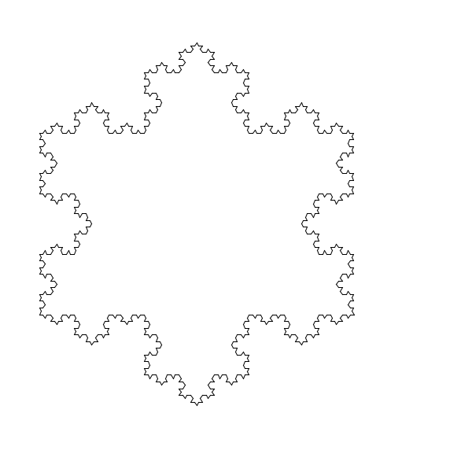
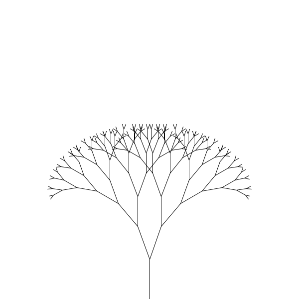
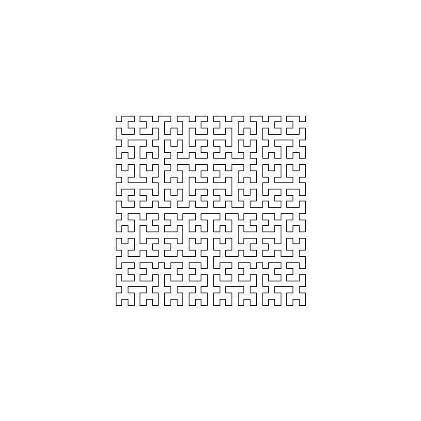
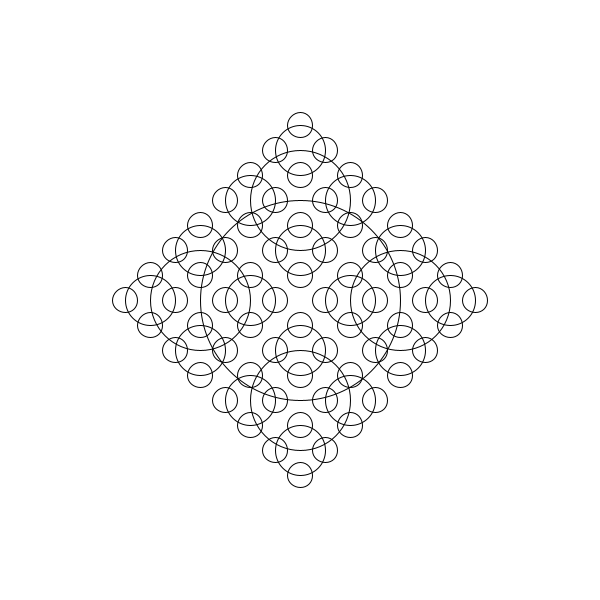
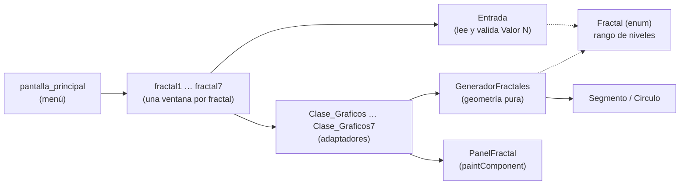

<div align="center">
  
  <h1>FractalWorld</h1>
  <p><b>Siete fractales recursivos dibujados con Java Swing: eliges el fractal, escribes el nivel y lo ves.</b></p>
  
  
  
  
  
  <a href="https://github.com/Luiss2080/FractalWorld/actions/workflows/ci.yml"></a>
  <p>
    <a href="#-inicio-rápido">Inicio rápido</a> ·
    <a href="#-características">Características</a> ·
    <a href="#%EF%B8%8F-arquitectura">Arquitectura</a> ·
    <a href="#-pruebas">Pruebas</a> ·
    <a href="#-lo-que-todavía-no-existe">Limitaciones</a>
  </p>
</div>

**FractalWorld** es una aplicación de escritorio en Java Swing que dibuja siete
fractales recursivos. En el menú principal eliges uno, escribes el nivel de
recursión (**Valor N**) y pulsas *Dibujar Fractal*. **No** es una animación ni una
simulación en tiempo real: cada pulsación calcula la figura completa y la muestra
de una vez; tampoco permite exportar la imagen.

## 🎬 Vista rápida

<table>
  <tr>
    <td align="center"><br /><sub>Copo de Koch · N=5</sub></td>
    <td align="center"><br /><sub>Árbol binario · N=8</sub></td>
  </tr>
  <tr>
    <td align="center"><br /><sub>Curva de Hilbert · N=5</sub></td>
    <td align="center"><br /><sub>Anillos · N=4</sub></td>
  </tr>
</table>

> Las imágenes **no son capturas de la ventana**: se generaron renderizando la
> clase real `PanelFractal` (con la geometría de `GeneradorFractales`) sobre un
> `BufferedImage` de 600 x 600 en modo headless. La ventana de Swing añade sus
> controles alrededor del lienzo.

Flujo de uso:

```text
Menú principal → elegir fractal (1 a 7) → escribir Valor N → "Dibujar Fractal"
   → figura completa en el lienzo (se conserva al redimensionar/minimizar)
   → valor vacío, decimal o fuera de rango: aviso en lugar de dibujar
```

## ✨ Características

| Característica | Detalle |
|---|---|
| Siete fractales | Koch, árbol binario, Sierpinski, Lévy C, Hilbert, anillos y pentágonos |
| Niveles acotados | Cada fractal declara su nivel máximo (`Fractal.java`) para evitar cuelgues y desbordes de pila |
| Validación de entrada | `Entrada` y `Fractal.parsearNivel` rechazan vacío, texto, decimales y fuera de rango con un mensaje |
| Geometría sin Swing | `GeneradorFractales` devuelve `Segmento` y `Circulo` puros, por eso se prueba sin interfaz |
| Dibujo persistente | `PanelFractal` guarda las figuras y las pinta en `paintComponent` |

### Fractales y niveles válidos

| # | Fractal | Qué dibuja | Niveles |
|---|---------|------------|---------|
| 1 | Copo de nieve de Koch | Triángulo cuyos lados se subdividen en 4 tramos | 1 - 7 |
| 2 | Árbol binario | Tronco con ramas que se bifurcan ±20°, de longitud `nivel * 10` px | 1 - 12 |
| 3 | Triángulo de Sierpinski | Subdivisión en 3 triángulos por nivel | 1 - 9 |
| 4 | Curva de Lévy C | Cada segmento se reemplaza por dos catetos de un triángulo rectángulo isósceles | 1 - 16 |
| 5 | Curva de Hilbert | Polilínea única de 4^N puntos | 1 - 7 |
| 6 | Anillos | Circunferencia con cuatro copias a mitad de tamaño | 1 - 7 |
| 7 | Pentágonos | Pentágono con otro a 1/3 del radio en cada vértice | 1 - 6 |

El nivel 1 es siempre la figura base.

## 🏗️ Arquitectura



Cada ventana `fractalN` (creada con el editor de NetBeans, con su `.form`) lee el
nivel, llama a su `Clase_GraficosN`, que pide la geometría a `GeneradorFractales`
y se la entrega a `PanelFractal`. El cálculo se hace en el hilo de eventos: en
los niveles máximos salen a lo sumo unas decenas de miles de figuras, por eso no
se usa un hilo aparte.

<details>
<summary>Estructura de carpetas</summary>

```text
src/
  Capa_Logica/
    Prueba_Logica.java            Punto de entrada; abre la ventana principal en el EDT
    Clase_Graficos*.java          Adaptadores generador -> panel
    geometria/
      GeneradorFractales.java     Geometría pura de cada fractal (sin Swing)
      Fractal.java                Enum con rango de niveles y validación
      Segmento.java, Circulo.java Figuras resultantes (records)
  capa_presentacion/
    pantalla_principal.java       Menú con los siete fractales
    fractal1..7.java              Una ventana por fractal (.form de NetBeans)
    PanelFractal.java             JPanel que guarda y pinta las figuras
    Entrada.java                  Lectura validada del campo "Valor N"
test/Capa_Logica/geometria/       Pruebas JUnit 5 de los generadores
docs/assets, docs/screenshots     Logo e imágenes del README
```

</details>

## 🚀 Inicio rápido

| Requisito | Versión |
|---|---|
| JDK | 21 (`maven.compiler.release` = 21) |
| Maven | 3.9+ (o Apache NetBeans, el proyecto conserva `build.xml` y `nbproject/`) |

```bash
git clone https://github.com/Luiss2080/FractalWorld.git
cd FractalWorld
mvn package                                   # genera target/fractalworld-1.0-SNAPSHOT.jar
java -jar target/fractalworld-1.0-SNAPSHOT.jar
```

Con NetBeans: abre la carpeta como proyecto y ejecuta `Capa_Logica.Prueba_Logica`.
`mvn test` se verificó en esta revisión; `mvn package` y el arranque de la
ventana con `java -jar` no se ejecutaron (el entorno no tenía escritorio).

## 🧪 Pruebas

```bash
mvn test        # 25 pruebas JUnit 5 (verificado: 25 ejecutadas, 0 fallos)
```

Cubren la geometría (conteo exacto de figuras por nivel, continuidad de las
polilíneas, Hilbert sin celdas repetidas ni ramificaciones, pentágono regular) y
la validación de niveles, incluido que el nivel máximo de cada fractal termina
rápido sin desbordar la pila. El workflow `.github/workflows/ci.yml` ejecuta
`mvn -B verify` en cada push y pull request. **No hay pruebas automáticas de la
interfaz Swing.**

## 🚧 Lo que todavía no existe

- Los botones *Cuadrado Relleno* y las flechas `<----` / `---->` de las ventanas
  de fractal son restos de un ejercicio: solo `---->` de la ventana 1 mueve un
  cuadrado; el resto no hace nada.
- En el menú principal, los campos *Comentario* y los botones *Enviar* no tienen función.
- Los parámetros geométricos (tamaños base, ángulos, posición fija del copo de
  Koch y de Sierpinski en 500 x 500 px) están escritos en el código.
- La curva 4 es la de **Lévy C**, no la del dragón de Heighway.
- Cerrar cualquier ventana con la X termina toda la aplicación.
- No se puede guardar ni exportar la imagen, ni animar la construcción.
- Sin verificar: apariencia final en otros sistemas operativos y accesibilidad con lectores de pantalla.

## 📄 Licencia

Sin licencia definida: todos los derechos reservados por defecto. Para permitir
su reutilización hay que añadir un archivo `LICENSE`.

<div align="center">
  <sub>Hecho por Luiss2080 · Java Swing + Maven</sub>
</div>
